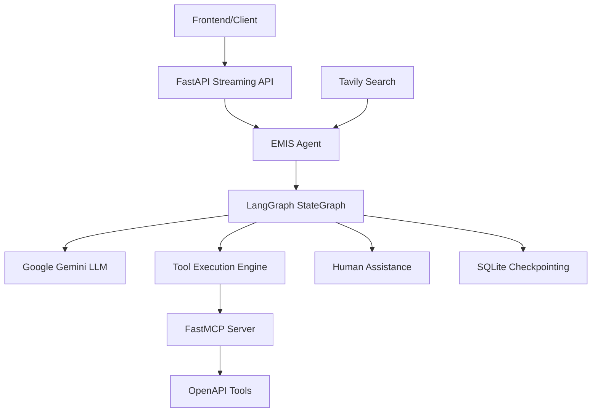

# MAS - Multi-Agent System for EMIS

A production-grade Education Management Information System (EMIS) agent built with LangGraph, featuring intelligent tool orchestration, human-in-the-loop interactions, and streaming API capabilities.

## 🚀 Overview

MAS (Multi-Agent System) is an advanced AI agent system designed for educational institutions. It leverages LangGraph for sophisticated workflow management, Google Gemini for natural language processing, and FastMCP for seamless OpenAPI tool integration.

### Key Features

- **🧠 Intelligent Agent**: LangGraph-based agent with advanced reasoning capabilities
- **🔧 Tool Integration**: FastMCP integration with OpenAPI-compatible tools
- **👥 Human-in-the-Loop**: Built-in escalation paths for human assistance
- **⚡ Parallel Processing**: Smart parallel tool execution with interrupt safety
- **💾 Persistent Memory**: SQLite-based checkpointing and session management
- **🌊 Streaming API**: Real-time streaming responses via FastAPI
- **📊 Multi-User Support**: Concurrent user sessions with task queuing
- **🔍 Advanced Search**: Tavily search integration for external data
- **🎯 Production Ready**: Comprehensive error handling, logging, and monitoring

## 🏗️ Architecture



### Core Components

1. **EMISAgent** (`main.py`) - Core agent orchestration
2. **FastAPI Server** (`streaming_api.py`) - HTTP streaming interface
3. **FastMCP Server** (`my_mcp_server.py`) - Tool integration layer
4. **LangGraph Workflows** - State management and flow control
5. **Memory System** - Session persistence and checkpointing

## 📋 Prerequisites

- Python 3.13+
- UV package manager (recommended) or pip
- Google API Key (for Gemini)
- Optional: Tavily API Key (for enhanced search)

## 🛠️ Installation

### 1. Clone the Repository

```bash
git clone <repository-url>
cd MAS
```

### 2. Environment Setup

Create a `.env` file in the project root:

```env
# Required
GOOGLE_API_KEY=your_google_api_key_here

# Optional
TAVILY_API_KEY=your_tavily_api_key_here
LANGCHAIN_API_KEY=your_langchain_api_key_here
LANGCHAIN_TRACING_V2=true
LANGCHAIN_PROJECT=emis-agent
```

### 3. Install Dependencies

#### Using UV (Recommended)

```bash
# Install UV if not already installed
curl -LsSf https://astral.sh/uv/install.sh | sh

# Install dependencies
uv sync

# Activate virtual environment
source .venv/bin/activate  # On Windows: .venv\Scripts\activate
```

#### Using pip

```bash
# Create virtual environment
python -m venv .venv
source .venv/bin/activate  # On Windows: .venv\Scripts\activate

# Install dependencies
pip install -r requirements.txt
```

### 4. Development Dependencies (Optional)

```bash
# Install development tools
uv sync --group dev

# Or with pip
pip install -e ".[dev]"
```

## 🚀 Running the Application

### 1. Start the FastMCP Server

First, ensure you have an OpenAPI-compatible backend running on `http://localhost:8080`, then start the MCP server:

```bash
python my_mcp_server.py
```

The MCP server will be available at `http://localhost:8000/mcp`

### 2. Start the Streaming API Server

```bash
python streaming_api.py
```

Or using uvicorn directly:

```bash
uvicorn streaming_api:app --host 0.0.0.0 --port 8000 --reload
```

The API will be available at:
- Main API: `http://localhost:8000`
- Documentation: `http://localhost:8000/docs`
- Alternative docs: `http://localhost:8000/redoc`

### 3. Test the Agent (CLI)

```bash
python main.py
```

This will start an interactive CLI session with the agent.

## 🔧 Configuration

### Environment Variables

| Variable | Required | Description | Default |
|----------|----------|-------------|---------|
| `GOOGLE_API_KEY` | Yes | Google Gemini API key | - |
| `TAVILY_API_KEY` | No | Tavily search API key | - |
| `LANGCHAIN_API_KEY` | No | LangChain tracing API key | - |
| `LANGCHAIN_TRACING_V2` | No | Enable LangChain tracing | `false` |
| `LANGCHAIN_PROJECT` | No | LangChain project name | `emis-agent` |

### Agent Configuration

The agent behavior can be configured by modifying the system prompt and parameters in `main.py`:

```python
# In EMISAgent.__init__()
self.llm = ChatGoogleGenerativeAI(
    model="gemini-2.0-flash",  # Model selection
    temperature=0.1,           # Creativity level
    # ... other parameters
)
```

### Tool Configuration

FastMCP tool routing can be configured in `my_mcp_server.py`:

```python
# Define routes to exclude
route_maps = [
    RouteMap(pattern=r"^/api/v1/schools/search/name", mcp_type=MCPType.EXCLUDE),
    RouteMap(pattern=r"^/api/v1/schools/search/location", mcp_type=MCPType.EXCLUDE),
    # Add more patterns as needed
]
```

## 📡 API Reference

### Streaming Chat Endpoint

**POST** `/chat/stream`

Start a new chat session with streaming responses.

```json
{
    "message": "Find all schools in New York with capacity over 500 students",
    "session_id": "optional-session-id"
}
```

Response: Server-Sent Events (SSE) stream with chunks:

```json
{
    "type": "thinking|tool_call|response|completed|error|human_input_needed",
    "content": "Response content",
    "session_id": "session-123",
    "timestamp": "2024-01-01T12:00:00Z"
}
```

### Resume Conversation

**POST** `/chat/resume`

Resume a conversation that requires human input.

```json
{
    "session_id": "session-123",
    "human_response": "Yes, proceed with the analysis"
}
```

### Health Check

**GET** `/health`

Check if the agent is initialized and ready.

```json
{
    "status": "healthy",
    "agent_initialized": true
}
```

## 🧪 Development

### Code Quality

The project uses several tools for code quality:

```bash
# Format code
black .
ruff format .

# Lint code
ruff check .

# Type checking
mypy .

# Run tests
pytest

# Run tests with coverage
pytest --cov=emis_agent --cov-report=html
```

### Pre-commit Hooks

Install pre-commit hooks:

```bash
pre-commit install
```

### Project Structure

```
MAS/
├── main.py                 # Core agent implementation
├── streaming_api.py        # FastAPI streaming server
├── my_mcp_server.py       # FastMCP tool integration
├── knowledge.md           # Implementation requirements
├── pyproject.toml         # Project configuration
├── .env                   # Environment variables (create this)
├── docs/                  # Additional documentation
│   └── langgraph_parallel_tools.md
├── .venv/                 # Virtual environment
├── __pycache__/          # Python cache
└── .ropeproject/         # Rope IDE configuration
```

### Adding New Tools

1. Define tools in your OpenAPI backend
2. Update route mappings in `my_mcp_server.py`
3. Test the integration through the streaming API

### Adding New Features

1. Create feature branch: `git checkout -b feature/your-feature`
2. Implement changes following the existing patterns
3. Add tests for new functionality
4. Update documentation
5. Submit pull request

## 🐛 Troubleshooting

### Common Issues

#### 1. Agent Not Initializing

```
Error: Agent not initialized
```

**Solution**: Ensure the FastMCP server is running and accessible:
```bash
# Check if MCP server is running
curl http://localhost:8000/mcp

# Restart the MCP server
python my_mcp_server.py
```

#### 2. Missing API Keys

```
Error: GOOGLE_API_KEY environment variable not set
```

**Solution**: Ensure your `.env` file contains the required API key:
```env
GOOGLE_API_KEY=your_actual_api_key_here
```

#### 3. Tool Execution Errors

```
Error: Tool 'xyz' not found
```

**Solution**: 
1. Verify the backend API is running on `http://localhost:8080`
2. Check the OpenAPI spec is accessible: `curl http://localhost:8080/v3/api-docs`
3. Restart the FastMCP server

#### 4. Parallel Tool Execution Issues

The system automatically handles parallel tool execution with interrupt safety. If you encounter issues:

1. Check the logs for specific tool failures
2. Verify network connectivity to external services
3. Review the parallel tool execution documentation in `docs/langgraph_parallel_tools.md`

### Debug Mode

Enable debug logging by setting the environment variable:

```bash
export PYTHONPATH="${PYTHONPATH}:."
export LOG_LEVEL=DEBUG
python streaming_api.py
```

### Performance Monitoring

Monitor agent performance:

```bash
# Check memory usage
ps aux | grep python

# Monitor API requests
tail -f uvicorn.log

# Check database connections (if using external DB)
netstat -an | grep 5432
```

## 📊 Performance Considerations

### Optimization Tips

1. **Caching**: Enable response caching for frequent queries
2. **Connection Pooling**: Use connection pools for database operations
3. **Async Operations**: Leverage async/await for I/O operations
4. **Tool Selection**: Use appropriate tools for specific tasks

### Scaling

For production deployment:

1. Use Gunicorn with multiple workers
2. Implement Redis for distributed caching
3. Set up load balancing
4. Monitor with Prometheus/Grafana

## 🤝 Contributing

1. Fork the repository
2. Create a feature branch
3. Make your changes
4. Add tests and documentation
5. Ensure code quality checks pass
6. Submit a pull request

### Code Standards

- Follow PEP 8 style guidelines
- Add type hints for all functions
- Include docstrings for public methods
- Write comprehensive tests
- Update documentation for new features

## 📄 License

This project is licensed under the MIT License - see the LICENSE file for details.

## 🙏 Acknowledgments

- [LangGraph](https://github.com/langchain-ai/langgraph) for the agent framework
- [FastMCP](https://github.com/chrishayuk/fastmcp) for OpenAPI tool integration
- [Google Gemini](https://ai.google.dev/) for language model capabilities
- [FastAPI](https://fastapi.tiangolo.com/) for the web framework

## 📞 Support

For questions and support:

1. Check the [troubleshooting section](#-troubleshooting)
2. Review existing [issues](link-to-issues)
3. Create a new issue with detailed information
4. Join our [community discussion](link-to-discussions)

---

**Happy coding!** 🚀# BE-emis-agent
