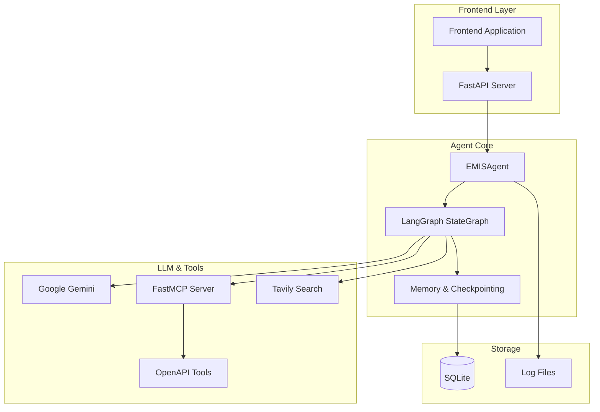

# MAS Development Guide

A comprehensive guide for developers contributing to the MAS (Multi-Agent System) project.

## 🎯 Overview

This guide covers everything you need to know to contribute effectively to MAS, from setting up your development environment to submitting pull requests.

### What You'll Learn

- Project architecture and design patterns
- Development workflow and best practices
- Testing strategies and quality assurance
- Code style and contribution guidelines
- Advanced debugging and troubleshooting

## 🏗️ Architecture Deep Dive

### System Components



### Core Design Patterns

#### 1. State Management Pattern
```python
# AgentState defines the conversation state
class AgentState(TypedDict):
    messages: Annotated[List[BaseMessage], add_messages]
    task_plan: Optional[str]
    current_step: int
    max_iterations: int
    iterations_used: int
    task_completed: bool
    pending_data: Dict[str, Any]
```

#### 2. Tool Execution Pattern
```python
# Tools are decorated functions that can be called by the agent
@tool
def search_schools(location: str, school_type: str = "all") -> str:
    """Search for schools in a specific location."""
    # Implementation here
    pass
```

#### 3. Human-in-the-Loop Pattern
```python
# Interrupts pause execution and wait for human input
@tool
def human_assistance(query: str) -> str:
    """Request assistance from a human when more information is needed."""
    human_response = interrupt({"query": query})
    return human_response['data']
```

#### 4. Streaming Response Pattern
```python
# Responses are streamed in real-time using Server-Sent Events
async def stream_response_chunks():
    for chunk in agent_response:
        yield f"data: {json.dumps(chunk)}\n\n"
```

### File Structure

```
MAS/
├── main.py                 # Core agent implementation
│   ├── class EMISAgent
│   ├── class AgentState
│   └── tool definitions
├── streaming_api.py        # FastAPI server with SSE
│   ├── FastAPI app setup
│   ├── streaming endpoints
│   └── CORS configuration
├── my_mcp_server.py       # FastMCP tool integration
│   ├── OpenAPI spec loading
│   ├── route mapping
│   └── schema fixes
├── knowledge.md           # Requirements and specifications
├── pyproject.toml         # Project configuration
├── docs/                  # Documentation
│   ├── SETUP_GUIDE.md
│   ├── API_REFERENCE.md
│   └── langgraph_parallel_tools.md
└── tests/                 # Test files (to be created)
```

## 🛠️ Development Environment Setup

### Prerequisites

- Python 3.13+
- UV package manager (recommended)
- Git
- Your favorite code editor with Python support

### IDE Configuration

#### VS Code Setup

Create `.vscode/settings.json`:
```json
{
    "python.defaultInterpreterPath": ".venv/bin/python",
    "python.formatting.provider": "black",
    "python.linting.enabled": true,
    "python.linting.ruffEnabled": true,
    "python.linting.mypyEnabled": true,
    "editor.formatOnSave": true,
    "editor.codeActionsOnSave": {
        "source.organizeImports": true
    }
}
```

Create `.vscode/launch.json` for debugging:
```json
{
    "version": "0.2.0",
    "configurations": [
        {
            "name": "Debug Streaming API",
            "type": "python",
            "request": "launch",
            "program": "streaming_api.py",
            "console": "integratedTerminal",
            "env": {
                "PYTHONPATH": "."
            }
        },
        {
            "name": "Debug Agent CLI",
            "type": "python",
            "request": "launch",
            "program": "main.py",
            "console": "integratedTerminal"
        }
    ]
}
```

#### PyCharm Setup

1. Open project in PyCharm
2. Configure Python interpreter to use `.venv/bin/python`
3. Enable automatic imports optimization
4. Set up code style to match Black configuration

### Initial Setup

1. **Fork and Clone**
   ```bash
   # Fork the repo on GitHub, then:
   git clone https://github.com/your-username/MAS.git
   cd MAS
   ```

2. **Environment Setup**
   ```bash
   # Install UV if not available
   curl -LsSf https://astral.sh/uv/install.sh | sh
   
   # Create virtual environment and install dependencies
   uv sync --group dev
   source .venv/bin/activate
   ```

3. **Pre-commit Hooks**
   ```bash
   # Install pre-commit hooks
   pre-commit install
   
   # Test the hooks
   pre-commit run --all-files
   ```

4. **Environment Variables**
   ```bash
   # Copy example env file
   cp .env.example .env
   
   # Edit with your API keys
   vim .env
   ```

## 🧪 Testing Strategy

### Test Structure

```
tests/
├── unit/                  # Unit tests
│   ├── test_agent.py
│   ├── test_tools.py
│   └── test_streaming.py
├── integration/           # Integration tests
│   ├── test_api_endpoints.py
│   └── test_mcp_integration.py
├── e2e/                   # End-to-end tests
│   └── test_user_flows.py
├── fixtures/              # Test data and fixtures
│   ├── mock_responses.json
│   └── test_sessions.db
└── conftest.py           # Pytest configuration
```

### Writing Tests

#### Unit Test Example
```python
# tests/unit/test_agent.py
import pytest
from unittest.mock import AsyncMock, MagicMock
from main import EMISAgent, AgentState

@pytest.fixture
async def mock_agent():
    agent = EMISAgent("test-api-key")
    agent.client = AsyncMock()
    agent.llm = MagicMock()
    return agent

@pytest.mark.asyncio
async def test_agent_initialization(mock_agent):
    """Test agent initializes correctly."""
    await mock_agent.initialize()
    assert mock_agent.graph is not None

@pytest.mark.asyncio
async def test_chat_with_simple_query(mock_agent):
    """Test agent handles simple chat queries."""
    # Setup mocks
    mock_agent.llm.ainvoke.return_value = MagicMock(
        content="Hello! I can help you with school information."
    )
    
    # Test
    response = await mock_agent.chat("Hello")
    
    # Assertions
    assert "Hello" in response
    assert mock_agent.llm.ainvoke.called
```

#### Integration Test Example
```python
# tests/integration/test_api_endpoints.py
import pytest
from fastapi.testclient import TestClient
from streaming_api import app

client = TestClient(app)

def test_health_endpoint():
    """Test health check endpoint."""
    response = client.get("/health")
    assert response.status_code == 200
    assert response.json()["status"] == "healthy"

@pytest.mark.asyncio
async def test_streaming_chat():
    """Test streaming chat endpoint."""
    response = client.post(
        "/chat/stream",
        json={"message": "Test message"},
        headers={"Accept": "text/event-stream"}
    )
    
    assert response.status_code == 200
    assert "text/event-stream" in response.headers["content-type"]
```

#### E2E Test Example
```python
# tests/e2e/test_user_flows.py
import pytest
import asyncio
from httpx import AsyncClient

@pytest.mark.asyncio
async def test_complete_conversation_flow():
    """Test a complete user conversation flow."""
    async with AsyncClient(base_url="http://localhost:8001") as client:
        # Start conversation
        response = await client.post(
            "/chat/stream",
            json={"message": "Find schools in California"}
        )
        
        assert response.status_code == 200
        
        # Parse streaming response
        session_id = None
        chunks = []
        
        async for line in response.aiter_lines():
            if line.startswith('data: '):
                chunk = json.loads(line[6:])
                chunks.append(chunk)
                session_id = chunk['session_id']
                
                if chunk['type'] == 'completed':
                    break
        
        # Verify conversation flow
        assert session_id is not None
        assert any(chunk['type'] == 'response' for chunk in chunks)
        
        # Follow up question
        follow_up = await client.post(
            "/chat/stream",
            json={
                "message": "Tell me more about the first school",
                "session_id": session_id
            }
        )
        
        assert follow_up.status_code == 200
```

### Running Tests

```bash
# Run all tests
pytest

# Run with coverage
pytest --cov=. --cov-report=html --cov-report=term-missing

# Run specific test categories
pytest tests/unit/
pytest tests/integration/
pytest tests/e2e/

# Run tests matching a pattern
pytest -k "test_agent"

# Run tests with verbose output
pytest -v

# Run tests in parallel (requires pytest-xdist)
pytest -n auto
```

### Test Configuration

Create `tests/conftest.py`:
```python
import pytest
import asyncio
import os
from unittest.mock import AsyncMock
from main import EMISAgent

# Set test environment variables
os.environ["GOOGLE_API_KEY"] = "test-key"
os.environ["TESTING"] = "true"

@pytest.fixture(scope="session")
def event_loop():
    """Create an instance of the default event loop for the test session."""
    loop = asyncio.get_event_loop_policy().new_event_loop()
    yield loop
    loop.close()

@pytest.fixture
async def test_agent():
    """Create a test agent with mocked dependencies."""
    agent = EMISAgent("test-api-key")
    agent.client = AsyncMock()
    return agent

@pytest.fixture
def mock_openapi_spec():
    """Mock OpenAPI specification for testing."""
    return {
        "openapi": "3.0.0",
        "info": {"title": "Test API", "version": "1.0.0"},
        "paths": {
            "/test": {
                "get": {
                    "summary": "Test endpoint",
                    "responses": {"200": {"description": "Success"}}
                }
            }
        }
    }
```

## 🎨 Code Quality Standards

### Code Style

The project uses several tools to maintain code quality:

#### Black (Code Formatting)
```bash
# Format all Python files
black .

# Check formatting without making changes
black --check .

# Format specific files
black main.py streaming_api.py
```

#### Ruff (Linting)
```bash
# Run linter
ruff check .

# Auto-fix issues
ruff check . --fix

# Check specific files
ruff check main.py
```

#### MyPy (Type Checking)
```bash
# Run type checking
mypy .

# Check specific files
mypy main.py streaming_api.py

# Generate type coverage report
mypy --html-report mypy_report .
```

### Code Standards

#### 1. Type Hints
Always use type hints:
```python
# Good
async def process_query(
    query: str, 
    session_id: Optional[str] = None
) -> Dict[str, Any]:
    pass

# Bad
async def process_query(query, session_id=None):
    pass
```

#### 2. Docstrings
Use Google-style docstrings:
```python
def calculate_school_metrics(
    enrollment: int, 
    capacity: int, 
    graduation_rate: float
) -> Dict[str, float]:
    """Calculate key metrics for a school.
    
    Args:
        enrollment: Current student enrollment
        capacity: Maximum school capacity
        graduation_rate: Graduation rate as decimal (0.0-1.0)
        
    Returns:
        Dictionary containing calculated metrics:
        - utilization_rate: Enrollment/capacity ratio
        - efficiency_score: Combined metric
        
    Raises:
        ValueError: If graduation_rate is not between 0 and 1
    """
    if not 0 <= graduation_rate <= 1:
        raise ValueError("Graduation rate must be between 0 and 1")
    
    return {
        "utilization_rate": enrollment / capacity,
        "efficiency_score": (enrollment / capacity) * graduation_rate
    }
```

#### 3. Error Handling
Use specific exception types and proper logging:
```python
import logging
from typing import Optional

logger = logging.getLogger(__name__)

async def fetch_school_data(school_id: str) -> Optional[Dict[str, Any]]:
    """Fetch school data from external API."""
    try:
        response = await api_client.get(f"/schools/{school_id}")
        response.raise_for_status()
        return response.json()
    except httpx.HTTPStatusError as e:
        logger.warning(f"HTTP error fetching school {school_id}: {e}")
        if e.response.status_code == 404:
            return None
        raise
    except httpx.RequestError as e:
        logger.error(f"Network error fetching school {school_id}: {e}")
        raise
    except Exception as e:
        logger.error(f"Unexpected error fetching school {school_id}: {e}")
        raise
```

#### 4. Async/Await Best Practices
```python
# Good: Proper async context management
async def process_multiple_schools(school_ids: List[str]) -> List[Dict]:
    async with httpx.AsyncClient() as client:
        tasks = [fetch_school_data(client, sid) for sid in school_ids]
        results = await asyncio.gather(*tasks, return_exceptions=True)
    return [r for r in results if not isinstance(r, Exception)]

# Good: Proper exception handling in async functions
async def safe_tool_execution(tool_name: str, **kwargs) -> str:
    try:
        result = await execute_tool(tool_name, **kwargs)
        return result
    except Exception as e:
        logger.error(f"Tool {tool_name} failed: {e}")
        return f"Tool execution failed: {str(e)}"
```

## 🐛 Debugging Techniques

### Logging Configuration

Set up structured logging:
```python
import structlog
import logging

# Configure structured logging
structlog.configure(
    processors=[
        structlog.stdlib.filter_by_level,
        structlog.stdlib.add_logger_name,
        structlog.stdlib.add_log_level,
        structlog.stdlib.PositionalArgumentsFormatter(),
        structlog.processors.TimeStamper(fmt="iso"),
        structlog.processors.StackInfoRenderer(),
        structlog.processors.format_exc_info,
        structlog.processors.UnicodeDecoder(),
        structlog.processors.JSONRenderer()
    ],
    context_class=dict,
    logger_factory=structlog.stdlib.LoggerFactory(),
    wrapper_class=structlog.stdlib.BoundLogger,
    cache_logger_on_first_use=True,
)

logger = structlog.get_logger(__name__)

# Usage
logger.info("Processing request", session_id=session_id, user_id=user_id)
logger.error("Tool execution failed", tool_name=tool_name, error=str(e))
```

### Debug Modes

#### Environment-based Debugging
```python
import os

DEBUG = os.getenv("DEBUG", "false").lower() == "true"
LOG_LEVEL = os.getenv("LOG_LEVEL", "INFO")

if DEBUG:
    import pdb; pdb.set_trace()  # Only in debug mode
```

#### Agent State Debugging
```python
def debug_agent_state(state: AgentState) -> None:
    """Print agent state for debugging."""
    if not DEBUG:
        return
        
    print(f"=== Agent State Debug ===")
    print(f"Messages: {len(state['messages'])}")
    print(f"Current Step: {state['current_step']}")
    print(f"Iterations Used: {state['iterations_used']}")
    print(f"Task Completed: {state['task_completed']}")
    print(f"Pending Data Keys: {list(state['pending_data'].keys())}")
    print(f"========================")
```

### Performance Profiling

#### Memory Profiling
```python
# Install: pip install memory-profiler psutil
from memory_profiler import profile
import psutil

@profile
def memory_intensive_function():
    """Function to profile memory usage."""
    # Your code here
    pass

def monitor_memory():
    """Monitor system memory usage."""
    process = psutil.Process()
    memory_info = process.memory_info()
    print(f"RSS: {memory_info.rss / 1024 / 1024:.2f} MB")
    print(f"VMS: {memory_info.vms / 1024 / 1024:.2f} MB")
```

#### Time Profiling
```python
import time
import functools

def timing_decorator(func):
    """Decorator to measure function execution time."""
    @functools.wraps(func)
    async def wrapper(*args, **kwargs):
        start_time = time.perf_counter()
        try:
            result = await func(*args, **kwargs)
            return result
        finally:
            end_time = time.perf_counter()
            execution_time = end_time - start_time
            logger.info(
                f"{func.__name__} executed",
                execution_time=f"{execution_time:.4f}s"
            )
    return wrapper

# Usage
@timing_decorator
async def slow_operation():
    await asyncio.sleep(1)
```

### Common Debugging Scenarios

#### 1. Agent Not Responding
```python
# Check agent state
def diagnose_agent_stuck(agent: EMISAgent, session_id: str):
    """Diagnose why agent might be stuck."""
    config = {"configurable": {"thread_id": session_id}}
    
    try:
        state = agent.graph.get_state(config)
        logger.info("Current state", state=state.values)
        
        # Check if waiting for human input
        if state.next == ("human_assistance",):
            logger.info("Agent waiting for human input")
        
        # Check iteration limits
        if state.values.get("iterations_used", 0) >= state.values.get("max_iterations", 10):
            logger.warning("Agent hit iteration limit")
            
    except Exception as e:
        logger.error("Failed to get agent state", error=str(e))
```

#### 2. Tool Execution Issues
```python
async def debug_tool_execution(tool_name: str, **kwargs):
    """Debug tool execution issues."""
    logger.info("Executing tool", tool_name=tool_name, args=kwargs)
    
    try:
        # Check if tool exists
        available_tools = await agent.client.list_tools()
        tool_names = [tool.name for tool in available_tools]
        
        if tool_name not in tool_names:
            logger.error("Tool not found", available_tools=tool_names)
            return
        
        # Execute with timeout
        result = await asyncio.wait_for(
            agent.client.call_tool(tool_name, kwargs),
            timeout=30.0
        )
        logger.info("Tool executed successfully", result=result)
        return result
        
    except asyncio.TimeoutError:
        logger.error("Tool execution timed out")
    except Exception as e:
        logger.error("Tool execution failed", error=str(e))
```

#### 3. Streaming Issues
```python
async def debug_streaming_response(response_generator):
    """Debug streaming response issues."""
    chunk_count = 0
    total_content = ""
    
    try:
        async for chunk in response_generator:
            chunk_count += 1
            total_content += chunk.get("content", "")
            
            logger.debug(
                "Streaming chunk", 
                chunk_num=chunk_count,
                chunk_type=chunk.get("type"),
                content_length=len(chunk.get("content", ""))
            )
            
            yield chunk
            
    except Exception as e:
        logger.error(
            "Streaming error",
            error=str(e),
            chunks_sent=chunk_count,
            total_content_length=len(total_content)
        )
        raise
    
    logger.info("Streaming completed", total_chunks=chunk_count)
```

## 🚀 Contributing Guidelines

### Contribution Workflow

1. **Create Issue**
   - Describe the feature/bug clearly
   - Include steps to reproduce (for bugs)
   - Add relevant labels

2. **Create Branch**
   ```bash
   git checkout -b feature/your-feature-name
   # or
   git checkout -b fix/bug-description
   ```

3. **Make Changes**
   - Follow code standards
   - Add tests for new functionality
   - Update documentation

4. **Test Changes**
   ```bash
   # Run tests
   pytest
   
   # Check code quality
   black --check .
   ruff check .
   mypy .
   
   # Run pre-commit hooks
   pre-commit run --all-files
   ```

5. **Commit Changes**
   ```bash
   git add .
   git commit -m "feat: add school search functionality
   
   - Add search by location and type
   - Include enrollment filtering
   - Add comprehensive tests
   - Update API documentation
   
   Closes #123"
   ```

6. **Push and Create PR**
   ```bash
   git push origin feature/your-feature-name
   ```

### Commit Message Format

Use conventional commits:
```
<type>[optional scope]: <description>

[optional body]

[optional footer(s)]
```

Types:
- `feat`: New feature
- `fix`: Bug fix
- `docs`: Documentation changes
- `style`: Code style changes (formatting, etc.)
- `refactor`: Code refactoring
- `test`: Adding or updating tests
- `chore`: Maintenance tasks

Examples:
```bash
feat(agent): add parallel tool execution support

Implement smart parallel tool execution while maintaining
interrupt safety for human-in-the-loop workflows.

- Add tool call filtering logic
- Merge multiple human assistance calls
- Prioritize human assistance over other tools
- Add comprehensive tests

Closes #456

fix(streaming): handle connection errors gracefully

- Add retry logic for failed connections
- Improve error messages
- Add connection timeout handling

Fixes #789
```

### Pull Request Guidelines

#### PR Template
```markdown
## Description
Brief description of changes made.

## Type of Change
- [ ] Bug fix (non-breaking change)
- [ ] New feature (non-breaking change)
- [ ] Breaking change (fix or feature that would cause existing functionality to not work as expected)
- [ ] Documentation update

## How Has This Been Tested?
Describe the tests you ran and how to reproduce them.

## Checklist:
- [ ] My code follows the style guidelines
- [ ] I have performed a self-review
- [ ] I have commented my code, particularly in hard-to-understand areas
- [ ] I have made corresponding changes to the documentation
- [ ] My changes generate no new warnings
- [ ] I have added tests that prove my fix is effective or that my feature works
- [ ] New and existing unit tests pass locally with my changes

## Screenshots (if applicable)
Add screenshots to help explain your changes.
```

#### Review Process

1. **Automated Checks**
   - All tests must pass
   - Code quality checks must pass
   - Coverage should not decrease significantly

2. **Manual Review**
   - At least one maintainer review required
   - Focus on architecture, security, and maintainability
   - Ensure documentation is updated

3. **Merge Requirements**
   - All conversations resolved
   - Up-to-date with main branch
   - Clean commit history (squash if needed)

## 📦 Release Process

### Version Management

We use semantic versioning (SemVer):
- MAJOR: incompatible API changes
- MINOR: backwards-compatible functionality
- PATCH: backwards-compatible bug fixes

### Release Workflow

1. **Prepare Release**
   ```bash
   git checkout main
   git pull origin main
   
   # Update version in pyproject.toml
   # Update CHANGELOG.md
   ```

2. **Create Release Branch**
   ```bash
   git checkout -b release/v1.2.0
   ```

3. **Final Testing**
   ```bash
   # Run full test suite
   pytest --cov=. --cov-report=html
   
   # Test in production-like environment
   docker-compose up -d
   ```

4. **Create Release**
   ```bash
   git tag v1.2.0
   git push origin v1.2.0
   ```

5. **Deploy**
   - Automated deployment via CI/CD
   - Update documentation
   - Announce release

### Changelog Format

```markdown
# Changelog

## [1.2.0] - 2024-01-01

### Added
- New school analytics dashboard
- Bulk data import functionality
- Advanced search filters

### Changed
- Improved streaming performance by 40%
- Updated UI components for better accessibility
- Refactored authentication system

### Fixed
- Fixed memory leak in long-running sessions
- Resolved timeout issues with large datasets
- Fixed edge case in human assistance routing

### Deprecated
- Old search API (will be removed in v2.0.0)

### Security
- Updated dependencies to address security vulnerabilities
```

## 🎓 Best Practices

### Architecture Patterns

1. **Dependency Injection**
   ```python
   class EMISAgent:
       def __init__(
           self, 
           llm: BaseChatModel,
           memory: BaseMemory,
           tools: List[BaseTool]
       ):
           self.llm = llm
           self.memory = memory
           self.tools = tools
   
   # Factory pattern for agent creation
   def create_agent(config: AgentConfig) -> EMISAgent:
       llm = create_llm(config.llm_config)
       memory = create_memory(config.memory_config)
       tools = create_tools(config.tools_config)
       return EMISAgent(llm, memory, tools)
   ```

2. **Strategy Pattern for Tool Execution**
   ```python
   class ToolExecutionStrategy:
       async def execute(self, tool_calls: List[ToolCall]) -> List[ToolResult]:
           raise NotImplementedError
   
   class ParallelExecutionStrategy(ToolExecutionStrategy):
       async def execute(self, tool_calls: List[ToolCall]) -> List[ToolResult]:
           # Execute tools in parallel
           pass
   
   class SequentialExecutionStrategy(ToolExecutionStrategy):
       async def execute(self, tool_calls: List[ToolCall]) -> List[ToolResult]:
           # Execute tools sequentially
           pass
   ```

3. **Observer Pattern for Events**
   ```python
   class AgentEventObserver:
       async def on_tool_start(self, tool_name: str, args: Dict):
           pass
       
       async def on_tool_complete(self, tool_name: str, result: str):
           pass
       
       async def on_human_assistance_needed(self, query: str):
           pass
   
   # Usage
   agent.add_observer(LoggingObserver())
   agent.add_observer(MetricsObserver())
   ```

### Performance Optimization

1. **Caching**
   ```python
   from cachetools import TTLCache
   import functools
   
   # Cache tool results
   tool_cache = TTLCache(maxsize=1000, ttl=300)  # 5-minute TTL
   
   @functools.lru_cache(maxsize=128)
   def expensive_computation(param: str) -> str:
       # Expensive operation
       pass
   ```

2. **Connection Pooling**
   ```python
   # Use connection pools for external APIs
   async with httpx.AsyncClient(
       limits=httpx.Limits(max_connections=20, max_keepalive_connections=5)
   ) as client:
       # Make requests
       pass
   ```

3. **Background Tasks**
   ```python
   import asyncio
   from typing import Dict, Any
   
   class BackgroundTaskManager:
       def __init__(self):
           self.tasks: Dict[str, asyncio.Task] = {}
       
       def start_task(self, name: str, coro) -> str:
           task = asyncio.create_task(coro)
           self.tasks[name] = task
           return name
       
       async def wait_for_task(self, name: str) -> Any:
           task = self.tasks.get(name)
           if task:
               return await task
   ```

### Security Considerations

1. **Input Validation**
   ```python
   from pydantic import BaseModel, validator
   
   class SchoolQuery(BaseModel):
       location: str
       school_type: str = "all"
       max_results: int = 50
       
       @validator('location')
       def validate_location(cls, v):
           if len(v) > 100:
               raise ValueError('Location too long')
           return v.strip()
       
       @validator('max_results')
       def validate_max_results(cls, v):
           if v > 1000:
               raise ValueError('Too many results requested')
           return v
   ```

2. **API Key Management**
   ```python
   import os
   from typing import Optional
   
   class SecureConfig:
       @staticmethod
       def get_api_key(service: str) -> Optional[str]:
           key = os.getenv(f"{service.upper()}_API_KEY")
           if not key:
               raise ValueError(f"Missing API key for {service}")
           return key
   ```

3. **Rate Limiting**
   ```python
   from collections import defaultdict
   import time
   
   class RateLimiter:
       def __init__(self, max_requests: int, time_window: int):
           self.max_requests = max_requests
           self.time_window = time_window
           self.requests = defaultdict(list)
       
       def is_allowed(self, identifier: str) -> bool:
           now = time.time()
           requests = self.requests[identifier]
           
           # Remove old requests
           while requests and requests[0] < now - self.time_window:
               requests.pop(0)
           
           # Check rate limit
           if len(requests) >= self.max_requests:
               return False
           
           requests.append(now)
           return True
   ```

## 📚 Learning Resources

### Essential Reading

1. **LangGraph Documentation**
   - [Core Concepts](https://langchain-ai.github.io/langgraph