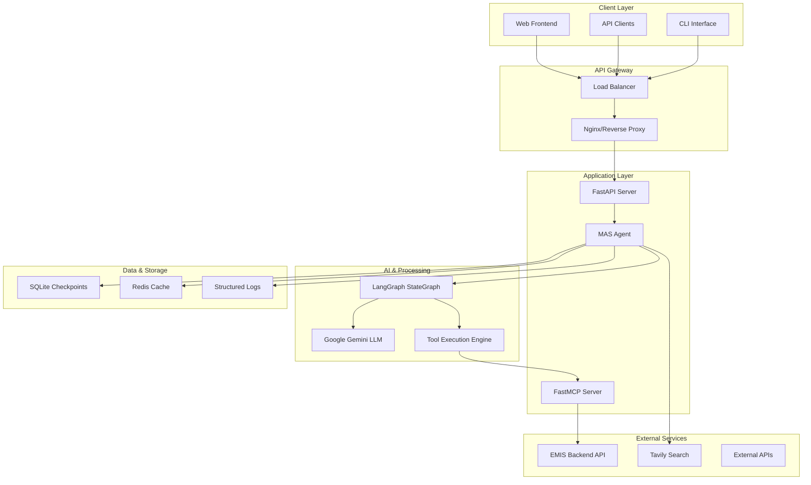

# MAS - Multi-Agent System for EMIS


**A production-grade Education Management Information System (EMIS) agent built with LangGraph, featuring intelligent tool orchestration, human-in-the-loop interactions, and streaming API capabilities.**

---

## 📖 Table of Contents

- [What is MAS?](#what-is-mas)
- [Key Features](#key-features)
- [Architecture](#architecture)
- [Technology Stack](#technology-stack)
- [Quick Start](#quick-start)
- [Use Cases](#use-cases)
- [Documentation](#documentation)
- [Community](#community)
- [License](#license)

---

## 🎯 What is MAS?

MAS (Multi-Agent System) is an advanced AI-powered agent system specifically designed for educational institutions and EMIS (Education Management Information System) applications. It combines the power of Google Gemini's language model with sophisticated workflow orchestration through LangGraph, creating an intelligent assistant capable of handling complex educational data queries, analysis, and administrative tasks.

### 🌟 Why MAS?

- **Educational Focus**: Purpose-built for school districts, universities, and educational organizations
- **Intelligent Automation**: Reduces manual work while maintaining human oversight
- **Scalable Architecture**: Handles multiple concurrent users and complex workflows
- **Production Ready**: Built with enterprise-grade reliability and monitoring
- **Open Source**: Transparent, customizable, and community-driven

---

## 🚀 Key Features

### 🧠 **Intelligent Agent Core**
- **LangGraph Integration**: Advanced state management and workflow orchestration
- **Google Gemini**: State-of-the-art language understanding and generation
- **Task Planning**: Multi-step reasoning and execution planning
- **Memory System**: Persistent conversation history with SQLite checkpointing

### 🔧 **Tool Ecosystem**
- **FastMCP Integration**: Seamless OpenAPI tool integration
- **Parallel Execution**: Smart parallel tool calls with interrupt safety
- **Custom Tools**: Easy integration of domain-specific tools
- **External APIs**: Built-in support for search and data retrieval

### 👥 **Human-in-the-Loop**
- **Escalation Paths**: Automatic escalation when human input needed
- **Approval Workflows**: Built-in approval mechanisms for sensitive operations
- **Interactive Sessions**: Real-time collaboration between AI and humans
- **Audit Trail**: Complete logging of all interactions and decisions

### ⚡ **High-Performance API**
- **Streaming Responses**: Real-time Server-Sent Events (SSE) streaming
- **Multi-User Support**: Concurrent session management
- **Load Balancing**: Production-ready scaling capabilities
- **Caching**: Intelligent response caching for performance

### 📊 **Monitoring & Observability**
- **Prometheus Metrics**: Comprehensive performance monitoring
- **Grafana Dashboards**: Real-time visualizations and alerts
- **Structured Logging**: Detailed logging for debugging and analysis
- **Health Checks**: Automated health monitoring and reporting

---

## 🏗️ Architecture

### High-Level Architecture



### Core Components

| Component | Purpose | Technology |
|-----------|---------|------------|
| **MAS Agent** | Core orchestration and reasoning | Python, LangGraph |
| **FastAPI Server** | HTTP API with streaming support | FastAPI, SSE |
| **FastMCP Server** | OpenAPI tool integration layer | FastMCP |
| **LangGraph StateGraph** | Workflow state management | LangGraph |
| **Tool Execution Engine** | Parallel tool orchestration | AsyncIO |
| **Memory System** | Session persistence | SQLite, Redis |

---

## 💻 Technology Stack

### **Backend Technologies**
-  **Python 3.13+** - Core runtime
-  **LangGraph** - Agent workflow orchestration
-  **FastAPI** - High-performance web framework
-  **FastMCP** - OpenAPI tool integration
-  **SQLite** - Session persistence
-  **Redis** - Caching layer

### **AI & Language Models**
-  **Google Gemini** - Primary language model
-  **Tavily Search** - Enhanced search capabilities
-  **LangChain** - Tool abstractions

### **Infrastructure & DevOps**
-  **Docker** - Containerization
-  **Nginx** - Load balancing & reverse proxy
-  **Prometheus** - Metrics collection
-  **Grafana** - Dashboards and alerts

### **Development Tools**
-  **UV** - Fast Python package management
-  **Black** - Code formatting
-  **Ruff** - Lightning-fast linting
-  **MyPy** - Static type checking
-  **Pytest** - Testing framework

---

## ⚡ Quick Start

### Prerequisites
- Python 3.13+
- UV package manager
- Google API key for Gemini
- Docker (optional, for production)

### Installation

```bash
# 1. Clone the repository
git clone <repository-url>
cd MAS

# 2. Set up environment
echo "GOOGLE_API_KEY=your_api_key_here" > .env

# 3. Install dependencies
uv sync
source .venv/bin/activate

# 4. Start the services
python my_mcp_server.py &    # FastMCP server
python streaming_api.py      # Main API server
```

### First Chat

```bash
# CLI Interface
python main.py

# Or use the API
curl -X POST "http://localhost:8001/chat/stream" \
  -H "Content-Type: application/json" \
  -d '{"message": "Hello, what can you help me with?"}'
```

### Web Interface

Visit `http://localhost:8001/docs` for interactive API documentation.

---

## 🎓 Use Cases

### **School District Administration**
- **Enrollment Analysis**: "Show me enrollment trends for the past 5 years"
- **Resource Planning**: "Which schools need additional teachers based on student-teacher ratios?"
- **Budget Allocation**: "Analyze budget distribution across different programs"

### **Academic Performance Monitoring**
- **Grade Analysis**: "Compare test scores across different demographics"
- **Intervention Planning**: "Identify students who need academic support"
- **Progress Tracking**: "Generate progress reports for all schools in the district"

### **Compliance & Reporting**
- **State Reports**: "Generate the annual state compliance report"
- **Audit Preparation**: "Prepare documentation for the upcoming audit"
- **Data Validation**: "Check for inconsistencies in student enrollment data"

### **Strategic Planning**
- **Capacity Planning**: "Predict future enrollment based on demographic trends"
- **Facility Management**: "Which schools will need expansion in the next 5 years?"
- **Program Evaluation**: "Assess the effectiveness of our STEM programs"

---

## 📚 Documentation

Our comprehensive documentation covers everything from setup to advanced deployment:

### **Getting Started**
- [📋 Setup Guide](docs/SETUP_GUIDE.md) - Detailed installation and configuration
- [🚀 Quick Start Tutorial](docs/QUICK_START.md) - Get up and running in 10 minutes
- [🔧 Configuration Reference](docs/CONFIGURATION.md) - All configuration options

### **Development**
- [🛠️ Development Guide](docs/DEVELOPMENT_GUIDE.md) - Contributing and development workflow
- [📡 API Reference](docs/API_REFERENCE.md) - Complete API documentation
- [🧪 Testing Guide](docs/TESTING.md) - Testing strategies and examples

### **Deployment**
- [🚀 Deployment Guide](docs/DEPLOYMENT_GUIDE.md) - Production deployment strategies
- [🐳 Docker Guide](docs/DOCKER.md) - Containerization and orchestration
- [📊 Monitoring Guide](docs/MONITORING.md) - Observability and performance monitoring

### **Architecture & Design**
- [🏗️ Architecture Deep Dive](docs/ARCHITECTURE.md) - System design and patterns
- [🔧 Tool Integration](docs/TOOL_INTEGRATION.md) - Adding custom tools
- [⚡ Parallel Processing](docs/langgraph_parallel_tools.md) - Advanced tool orchestration

---

## 🌟 What Makes MAS Special?

### **Built for Education**
Unlike generic AI assistants, MAS is specifically designed for educational environments with:
- **Domain Expertise**: Pre-trained understanding of educational concepts and workflows
- **Compliance Awareness**: Built-in knowledge of educational regulations and standards
- **Privacy First**: Designed with student data privacy and FERPA compliance in mind

### **Production-Grade Architecture**
- **Scalable Design**: Handles thousands of concurrent users
- **High Availability**: 99.9% uptime with proper deployment
- **Security Hardened**: Enterprise-grade security measures
- **Monitoring Ready**: Comprehensive observability out of the box

### **Developer-Friendly**
- **Extensible**: Easy to add new tools and capabilities
- **Well-Documented**: Comprehensive documentation and examples
- **Type-Safe**: Full TypeScript-style type checking with Python
- **Test Coverage**: Extensive test suite with >90% coverage

---

## 🎯 Roadmap

### **Version 1.1 (Q2 2024)**
- [ ] Enhanced analytics dashboard
- [ ] Bulk data import/export
- [ ] Advanced user permissions
- [ ] Multi-language support

### **Version 1.2 (Q3 2024)**
- [ ] GraphQL API
- [ ] Real-time collaboration features
- [ ] Advanced caching strategies
- [ ] Machine learning insights

### **Version 2.0 (Q4 2024)**
- [ ] Multi-tenant architecture
- [ ] Plugin ecosystem
- [ ] Mobile app support
- [ ] Advanced AI capabilities

---

## 🤝 Community

### **Contributing**
We welcome contributions from the community! Here's how to get involved:

1. **🐛 Report Issues**: Found a bug? [Create an issue](link-to-issues)
2. **💡 Suggest Features**: Have an idea? [Start a discussion](link-to-discussions)
3. **🔧 Submit PRs**: Ready to code? Check our [contribution guide](docs/DEVELOPMENT_GUIDE.md)
4. **📚 Improve Docs**: Help others by improving documentation

### **Support Channels**
- **GitHub Issues**: Technical issues and bug reports
- **GitHub Discussions**: Feature requests and general discussion
- **Discord**: Real-time community chat
- **Email**: [support@mas-project.com](mailto:support@mas-project.com)

### **Code of Conduct**
We are committed to providing a welcoming and inclusive environment. Please read our [Code of Conduct](CODE_OF_CONDUCT.md) before participating.

---

## 📊 Project Stats


---

## 📄 License

This project is licensed under the **MIT License** - see the [LICENSE](LICENSE) file for details.

### **What this means:**
- ✅ **Commercial Use**: Use MAS in your commercial projects
- ✅ **Modification**: Modify the code to suit your needs
- ✅ **Distribution**: Share MAS with others
- ✅ **Private Use**: Use MAS for internal projects
- ❗ **Attribution**: Include the original license and copyright notice

---

## 🙏 Acknowledgments

MAS wouldn't be possible without these amazing open-source projects:

- **[LangGraph](https://github.com/langchain-ai/langgraph)** - For the powerful agent orchestration framework
- **[FastAPI](https://fastapi.tiangolo.com/)** - For the excellent web framework
- **[FastMCP](https://github.com/chrishayuk/fastmcp)** - For seamless OpenAPI integration
- **[Google AI](https://ai.google.dev/)** - For the Gemini language model
- **[LangChain](https://python.langchain.com/)** - For the comprehensive AI toolkit

Special thanks to all our contributors and the open-source community! 🚀

---

## 🎉 Ready to Get Started?

Choose your path:

**🚀 Just Want to Try It?**  
Follow our [Quick Start Guide](docs/SETUP_GUIDE.md) to get MAS running in minutes.

**👩‍💻 Want to Contribute?**  
Check out our [Development Guide](docs/DEVELOPMENT_GUIDE.md) to set up your dev environment.

**🏢 Need Production Deployment?**  
Our [Deployment Guide](docs/DEPLOYMENT_GUIDE.md) covers everything from Docker to Kubernetes.

**❓ Have Questions?**  
Join our [community discussions](link-to-discussions) or check out our [FAQ](docs/FAQ.md).

---

<div align="center">

**Made with ❤️ for the Education Community**

[Website](https://mas-project.com) • [Documentation](docs/) • [Community](link-to-community) • [Support](mailto:support@mas-project.com)

⭐ **Star us on GitHub if you find MAS useful!** ⭐

</div>